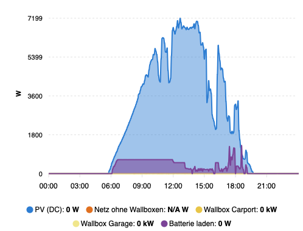

# Energy dashboard — entity reference (installation-specific)

Reference for **power / energy visualizations** (e.g. ApexCharts, Energy dashboard).  
IDs below match this Home Assistant installation; replace or fork for other sites.

## ApexCharts: day power chart (two layouts)

Example (this installation — **single-day** card, PV and battery as **areas**):



Dieselbe **Kurven-/Flächen**-Darstellung verwenden **`apexcharts_power_day_card.yaml`** (nur **heute**) und **`apexcharts_power_day_swipe.yaml`** (**heute** + **3 vorherige Tage** per Wischen); der Screenshot zeigt die **Einzelkarte**.

| Layout | File in repo | Depends on |
|--------|----------------|------------|
| **One card** (calendar today, `now` marker) | [`apexcharts_power_day_card.yaml`](apexcharts_power_day_card.yaml) | HACS **ApexCharts Card**; template `sensor.grid_net_excl_wallboxes` (see below); power entity for battery (e.g. `sensor.battery_charging_power`), **not** kWh energy. |
| **Swipe** (today + 3 previous days) | [`apexcharts_power_day_swipe.yaml`](apexcharts_power_day_swipe.yaml) | Same as above + HACS **Swipe Card** (`custom:swipe-card`). Older days use `now: false`. |

Paste the YAML into the dashboard **raw editor** as one card (swipe wraps several `custom:apexcharts-card` children). After edits in the repo, keep HA in sync (e.g. `./scripts/sync-to-home-assistant.sh` for automations/helpers; chart YAML is documentation-only unless you copy it manually).

## Entities

| Role | Entity ID | Notes |
|------|-----------|--------|
| PV (roof / strings, DC sum) | `sensor.total_dc_power` | **DC**-side total; AC inverter output can differ slightly. Unit is usually **W** (confirm in Developer tools). |
| Battery **power** (charging, W) | `sensor.battery_charging_power` (example) | For **power-over-time** charts use **`device_class: power`** / **W**. |
| Battery **energy** (e.g. daily charge) | `sensor.battery_charge` / `sensor.battery_charge_nominal` | Often **kWh** or cumulative **energy** — **not** the same as power; wrong choice flattens on 0 or shows kWh in a W chart. |
| Grid net (import / export) | `sensor.net_consumption_rounded` | **Raw grid coupling** vs. site load. **Important:** for analysis and charts, treat **`net_consumption_rounded` as including wallbox load** — **subtract both wallbox powers** to get grid flow **without** EV charging (see [Grid excluding wallboxes](#grid-excluding-wallboxes)). **Sign convention:** confirm in HA (often **positive = grid import**, **negative = export**). |
| Net grid excl. wallboxes (computed) | `sensor.grid_net_excl_wallboxes` | **`net_consumption_rounded − carport − garage`**; wallbox **unavailable** → **0 W**. Defined in **`yaml/pvoptimizer_helpers.yaml`**. |
| Wallbox carport | `sensor.carport_power` | EV charger **power** (W). **Subtract from** `net_consumption_rounded` when isolating non-EV grid. |
| Wallbox garage | `sensor.garage_power` | EV charger **power** (W). **Subtract from** `net_consumption_rounded` when isolating non-EV grid. |

## Grid excluding wallboxes

**Intent:** same sign convention as `sensor.net_consumption_rounded`, but **without** Carport- und Garage-Wallbox-Leistung.

\[
\text{grid}_{\text{excl. EV}} \approx \text{net\_consumption\_rounded} - \text{carport\_power} - \text{garage\_power}
\]

**Assumptions (verify on your site):**

- All inputs are **W** and comparable at the same instant.
- **`carport_power`** / **`garage_power`:** if state is **`unknown`**, **`unavailable`**, **`none`**, or empty, treat power as **0** (same as idle).

### Template sensor (`sensor.grid_net_excl_wallboxes`)

Defined in **`yaml/pvoptimizer_helpers.yaml`** together with the other PVoptimizer helpers. Include that file under **`homeassistant: packages:`**, then **check configuration** and reload **YAML configuration** (or restart). Entity id: **`sensor.grid_net_excl_wallboxes`**.

If you **do not** use `pvoptimizer_helpers.yaml`, paste the block below under `template:` elsewhere:

```yaml
template:
  - sensor:
      - name: Grid net excl. wallboxes
        unique_id: pvoptimizer_grid_net_excl_wallboxes_w
        unit_of_measurement: W
        device_class: power
        state_class: measurement
        state: >
          
          
          
          
          
          
          {{ net - cp_w - gr_w }}
```

Use this entity in ApexCharts instead of raw `net_consumption_rounded` when you want **Netz ohne Wallboxen**. Ready-made card: **[`apexcharts_power_day_card.yaml`](apexcharts_power_day_card.yaml)**. **Multiple days:** swipe variant **[`apexcharts_power_day_swipe.yaml`](apexcharts_power_day_swipe.yaml)** (requires HACS **Swipe Card**).

## Derived ideas (optional)

- **Total wallbox power:** `carport_power` + `garage_power` (second series in chart or small template sensor).
- **House load without EV:** depends on definitions; with the subtraction above you isolate **grid coupling excluding EV**. Full “Haus ohne alles” may still need PV/battery terms — sign conventions matter.
- **Daily kWh (PV / battery / house):** separate from these **instant power** sensors — use **Energy dashboard** assignments, **integration sensors**, or **utility_meter** on energy entities.

## Checks before chart YAML

1. Developer tools → **States**: unit (`W` / `kW`), update frequency, `unknown` behaviour.  
2. History: open each entity and confirm curves look plausible for one day.  
3. **Net consumption:** note whether positive means import — document here once verified:

   - `sensor.net_consumption_rounded`: positive = *(fill in: import / export)*  
   - For charts **without wallbox share**, use **`net_consumption_rounded − carport_power − garage_power`** (or the template sensor in [§ Grid excluding wallboxes](#grid-excluding-wallboxes)).

4. **Battery:** chosen canonical entity for charts: *(fill in: `sensor.…`)*
