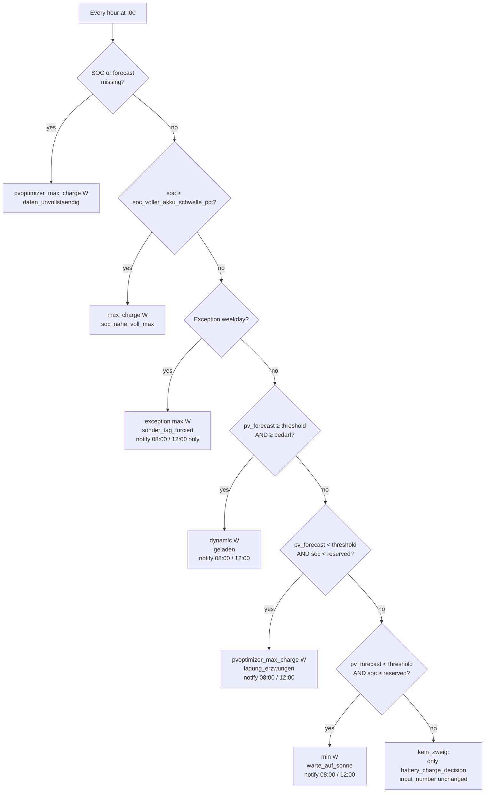

# PVoptimizer — Battery charge automation

This document describes the Home Assistant automations in this repository that implement **forecast- and SOC-aware limiting of battery max charge power** (Sungrow-oriented naming in the original setup).

Copies of the live YAML live in **`../yaml/`** so you can diff or install them without reading the narrative here.

---

## Table of contents

- [Home Assistant compatibility](#home-assistant-compatibility)
- [Business purpose](#business-purpose)
- [Goals](#goals)
- [Files in this repository](#files-in-this-repository)
- [Home Assistant wiring](#home-assistant-wiring)
- [Entities the automation expects](#entities-the-automation-expects)
- [PV forecast: Open-Meteo Solar Forecast](#pv-forecast-open-meteo-solar-forecast)
- [Optional DWD weather pessimization](#optional-dwd-weather-pessimization)
- [Tunables (in `variables` / literals)](#tunables-in-variables--literals)
- [Computed quantities](#computed-quantities-conceptual)
- [Robustness (clamping & valid range)](#robustness-clamping--valid-range)
- [Decision order](#decision-order-choose-branches)
- [Notifications](#notifications)
- [Reset automation](#reset-automation)
- [Assumptions and caveats](#assumptions-and-caveats)
- [Testing and verification](#testing-and-verification)
- [Optional dashboard (Lovelace)](#optional-dashboard-visualization-lovelace)
- [Day power chart (ApexCharts)](#day-power-chart-apexcharts)
- [Installing from GitHub](#installing-from-github)
- [Versioning](#versioning)

## Home Assistant compatibility

- **Target:** Home Assistant **2024.1** or newer for the bundled YAML as written (`triggers` / `conditions` / `actions`, nested `choose`, and `system_log.write`).
- On older versions you may need legacy `trigger` / `condition` / `action` keys and a substitute for **`system_log.write`** (e.g. `logbook.log` only) if the service is missing.

---

## Business purpose

The PVoptimizer aligns **battery charge power** (from **PV only** in the intended installation) with **expected production** and **needs**, so charging is timed and sized for operational goals—not a single fixed “always max” limit.

**Assumption for this documentation:** the battery is **not** charged from the grid; surplus after the house load is either stored or **exported**. Limits on charge power therefore affect how PV energy is **shared in time** between the battery and the grid, not mix-in of purchased power.

### Outcomes the design targets

1. **Softer, steadier grid feed-in with fewer export spikes**  

   When the forecast indicates enough PV generation to cover household demand and fill the battery, charging can be moderated instead of running at maximum power from the start. A dynamic target, for example toward mid-afternoon, allows the battery to absorb PV production over a longer period.

   If the battery charges at full speed, it may reach a high state of charge early in the day. Once the battery is nearly full, any remaining PV surplus is exported to the grid as a sharp peak. By slowing the charge rate, the battery remains available as a buffer for longer, resulting in smoother and more level grid feed-in: less of an export valley while the battery is filling, and less of a tall export peak once it is full.

   At the same time, this supports the grid. If the EV is not charging, PV energy can already be exported in the morning instead of being almost completely absorbed by the home battery. This allows other consumers in the local grid to benefit from locally generated solar power earlier in the day. The grid operator also has to deal with a more gradual and predictable feed-in profile, rather than a sudden transition from very low export to high kW export once the battery is full.

   A moderated charging strategy can also be gentler on the battery. Lower charging currents typically generate less heat and reduce stress on the battery cells, which can be beneficial for battery chemistry and long-term battery health.

2. **Resilience on poor-sunshine days**  
   When the forecast is weak **and** the battery is still low, the logic **forces high charge power** so you do not run into the evening with an empty pack while hoping for sun that will not arrive. The business trade-off is explicit: **security of supply** beats stretching the charge window when SOC is critical.

3. **Comfortable reserve without rushing the pack from PV**  
   When the forecast is weak but SOC is already adequate, charge power is **cut to a minimum** (“wait for sun”). That avoids **pushing PV hard into the battery** to top up quickly when you already have enough buffer for typical overnight use—still **PV-only**, but gentler use of the headroom you have.

4. **Planned operational exception (one weekday)**  
   One day a week can **override** forecast math and set a **lower (or other) max charge power** (default: weekday **4** = Friday at **2500 W** via helpers). Use this when you know demand will spike (e.g. weekend load). **Weekday** and **watts** are **`input_number`** tunables.

5. **Predictable handover at night**  
   The evening **reset** sets the charge limit from **`input_number.pvoptimizer_max_charge_w`**, **clamped** to **`set_sg_battery_max_charge_power`’s** HA **min**/**max**, so night / non-PV behaviour stays aligned with your standard cap **and** the inverter integration.

6. **Governance with limited noise**  
   Hourly execution keeps the strategy **responsive**; notifications only at **08:00** and **12:00** give operators enough **visibility** for decisions and troubleshooting without hourly push fatigue.

7. **Small-plant / EV synergy**  

   For smaller PV systems, for example around 8 kWp, this steadier battery behavior also helps the rest of the energy stack, such as EVCC or the wallbox. A smoother surplus signal makes it easier to ramp EV charging gradually instead of reacting to large swings in available power.

   A practical charging pattern could be to start the EV session earlier on single-phase 16 A (1P 16 A, about 3.7 kW), then switch to three-phase 6 A (3P 6 A, about 4.1 kW), and later increase to 3P 10 A as the PV curve allows. This keeps the EV charging session more continuous and helps use more of the limited roof peak, instead of waiting until the battery is already full and only responding to a short export spike.

### What this is not

- It is **not** a full retail optimization engine (no dynamic spot prices in the YAML as shipped).  
- It is **not** a warranty on inverter or battery hardware—limits still need to match vendor guidance.  
- Forecast and sensor quality dominate results; **garbage in → wrong outcome**.  
- It does **not** model installations where **grid charging** is deliberately used; if your site charges from the grid, reinterpret the business bullets accordingly.

---

## Goals

- Run **charge strategy logic every hour** (top of the hour) so the inverter limit tracks changing forecast and SOC during the day.
- When SOC is **at or above** **`soc_voller_akku_schwelle_pct`** (default **95**), set max charge power to the **standard** cap (**`max_charge_w`** = **`pvoptimizer_max_charge_w`** after slider clamp)—**before** exception weekday and forecast arms.
- **Notify** (Pushsafer via `notify.lanar`) only at **08:00** and **12:00**, not on every hourly run.
- Each evening, **reset** the charge power cap to **`input_number.pvoptimizer_max_charge_w`**, scaled to **`set_sg_battery_max_charge_power`’s** legal **min**/**max** so night behaviour stays predictable and valid.

---

## Files in this repository

| File | Role |
|------|------|
| `yaml/pvoptimizer_charge.yaml` | Automation id `1751448147075` — hourly logic: if SOC ≥ **`soc_voller_akku_schwelle_pct`** → **`max_charge_w`** / **`soc_nahe_voll_max`**; else optional **DWD** on **`pv_forecast`**, outer **`choose`** for incomplete SOC/forecast, **`state_attr` min/max** on writes, **`kein_zweig`**, `system_log.write` |
| `yaml/pvoptimizer_reset.yaml` | Automation id `1751732737952` — 20:00 reset: **`pvoptimizer_max_charge_w`** clamped like the charge automation |
| `yaml/pvoptimizer_helpers.yaml` | Optional package: standard / exception caps, **optional DWD** tunables, **template sensor** **`sensor.grid_net_excl_wallboxes`** (net grid − wallboxes) |
| `docs/assets/mushroom-battery-card.png` | Optional screenshot for the Lovelace example |
| `docs/assets/apexcharts_power_day_example.png` | Optional screenshot: day power chart (PV + battery as areas, single-day ApexCharts) |

IDs are fixed so that replacing the YAML on an existing HA instance keeps history and entity links stable when possible.

**Comments in YAML:** Only a short note appears on the optional helpers file; behavior and tuning are described in this document, not duplicated in the automations.

---

## Home Assistant wiring

### Include in `automations.yaml`

```yaml
- !include automations/pvoptimizer_charge.yaml
- !include automations/pvoptimizer_reset.yaml
```

Order only affects display order in the UI; behaviour does not depend on it.

### Related config (example)

The original setup also defines a helper referenced by the automation (abbreviated):

```yaml
input_text:
  battery_charge_decision:
    name: Battery charge decision
    max: 30
```

Place this (or equivalent) in `configuration.yaml` or a merged package. The automation writes short **tokens** to **`input_text.battery_charge_decision`** (e.g. `geladen`, `daten_unvollstaendig`, `soc_nahe_voll_max`, `kein_zweig`) for traces and dashboards—these identifiers are **stable** and not translated so existing automations keep working.

**Parameter helpers** (recommended): include **`yaml/pvoptimizer_helpers.yaml`** as a package (see [Files in this repository](#files-in-this-repository)) or merge its `input_number` block. Defaults: standard max **5000 W**, exception weekday **4** (Friday), exception max **2500 W**.

---

## Entities the automation expects

If your installation uses different entity IDs, edit **`pvoptimizer_charge.yaml`**. Expected entities:

### Sensors

| Variable / use | Entity (example) | Notes |
|----------------|------------------|--------|
| SOC | `sensor.battery_level` | Percent 0–100 |
| Pack size | `sensor.battery_capacity` | Energy in **kWh** for fill/dynamic math; default **10** if missing |
| PV forecast (kWh) | `sensor.pv_forecast_today` | **Placeholder name** in repo YAML—often backed by **[Open-Meteo Solar Forecast](#pv-forecast-open-meteo-solar-forecast)** or another integration; must match **`bedarf`** in **kWh** and in semantics (**full day** vs **remaining today**) |
| Recent discharge / load proxy | `sensor.battery_discharge_avg_3m` | Short-term consumption heuristic; scaled by **1.1** (default **10** if missing) |

### Number / text helpers

| Entity | Purpose |
|--------|---------|
| `input_boolean.pvoptimizer_dwd_adjustment_enabled` | **Off:** raw PV forecast only. **On:** blend DWD cloud / precip / fog into **`pv_forecast`** ([DWD §](#optional-dwd-weather-pessimization)) |
| `input_number.pvoptimizer_dwd_*` | Thresholds and multipliers for that blend (see table in [DWD §](#optional-dwd-weather-pessimization)) |
| `input_number.set_sg_battery_max_charge_power` | **Target** the automation writes (max charge power, W). Its HA **`min`** / **`max`** attributes define the **only** range ever sent to `input_number.set_value` (**fallback 0 / 20000** if attributes are missing). |
| `input_number.set_sg_max_soc` | Upper SOC **%** for “room to charge”; drives **`batterieladung`**, **`bedarf`**, dynamic cap |
| `input_number.set_sg_reserved_soc_for_backup` | Reserve SOC **%**; below this on a “bad” forecast day → **forced** standard max; at/above → **min** W |
| `input_number.pvoptimizer_max_charge_w` | Plant-specific **standard** max W (missing data, forced branch, dynamic ceiling, evening reset) |
| `input_number.pvoptimizer_exception_max_charge_w` | Max W on the configured **exception weekday** |
| `input_number.pvoptimizer_exception_weekday` | **0** = Monday … **6** = Sunday (Python `weekday()`) |
| `input_text.battery_charge_decision` | Last branch label (traceability) |

### Notify service

| Service | Purpose |
|---------|---------|
| `notify.lanar` | Pushsafer (original). **Change** every `action: notify.lanar` block if you use `notify.mobile_app_*` or another integration |

---

## PV forecast: Open-Meteo Solar Forecast

`sensor.pv_forecast_today` in **`pvoptimizer_charge.yaml`** is an **example entity id**. It does not exist until you define it—often via the **[Open-Meteo Solar Forecast](https://github.com/rany2/ha-open-meteo-solar-forecast)** custom integration (free API, no vendor lock-in).

### 1. Install

- **HACS:** **Integrations** → search **Open-Meteo Solar Forecast** → install → **restart** Home Assistant. If it is not in the default catalog, add the custom repository **`https://github.com/rany2/ha-open-meteo-solar-forecast`** (category **Integration**), then install.  
  Shortcut: [HACS “Open external repository”](https://my.home-assistant.io/redirect/hacs_repository/?owner=rany2&repository=ha-open-meteo-solar-forecast&category=integration).
- **Manual:** From the [integration releases](https://github.com/rany2/ha-open-meteo-solar-forecast/releases/latest), unpack and copy **`custom_components/open_meteo_solar_forecast`** into **`config/custom_components/`**, then restart.

### 2. Add the integration

**Settings → Devices & services → Add integration** → search **Open-Meteo Solar Forecast**.

Give the instance a clear **title** (e.g. `House` or `Roof South`)—it becomes part of the **entity id**. Typical fields:

| Field | Meaning |
|--------|--------|
| Latitude / longitude | Array location |
| **Declination** | Panel tilt (°) |
| **Azimuth** | 0° = N, 90° = E, **180° = S**, 270° = W |
| **Modules power** | DC peak power (W<sub>p</sub>); comma-separated lists for **multiple arrays** (same integration) |

Use a **dot** as decimal separator (e.g. `0.93`), even in locales that use commas; **commas** separate values per array. Optional: **`dc_efficiency`**, **damping**, **horizon** files for shading—see the [project README](https://github.com/rany2/ha-open-meteo-solar-forecast/blob/master/README.md).

### 3. Find the sensor entity id

The integration registers sensors as:

```text
sensor.<slug>_<key>
```

- **`<slug>`** = slugified **instance title** from the config flow (lowercase, spaces → underscores; special characters may be normalized).
- **`<key>`** = forecast quantity, e.g. **`energy_production_today`**, **`energy_production_today_remaining`**, **`energy_production_tomorrow`**.

Examples: title **`House`** → `sensor.house_energy_production_today`.  
Confirm under **Settings → Devices & services → Open-Meteo Solar Forecast → <instance>** or **Developer tools → States**.

| Sensor (suffix) | Typical use with PVoptimizer |
|-----------------|------------------------------|
| **`energy_production_today`** | Model **full calendar day** PV energy (midnight→midnight in the forecast). |
| **`energy_production_today_remaining`** | PV energy **from now** until end of today—often closer to “what is still coming” for **hourly** decisions midday. |

Pick the one whose meaning matches how you compare to **`bedarf`** ([Assumptions](#assumptions-and-caveats)).

### 4. Point PVoptimizer at that sensor

Either:

- **Edit YAML:** In **`pvoptimizer_charge.yaml`**, replace every **`sensor.pv_forecast_today`** with your real entity (e.g. `sensor.house_energy_production_today_remaining`), **or**
- **Alias:** Create a **template sensor** (or helper) named `sensor.pv_forecast_today` that returns the Open-Meteo entity so you keep the stock automation file unchanged.

### 5. kWh vs Wh (must match `bedarf`)

The integration exposes **energy** sensors (native **Wh** in code; Home Assistant may **display** **kWh**). **`bedarf`** in PVoptimizer is treated as **kWh** next to the forecast.

In **Developer tools → States**, check the **numeric `state`** and **unit**:

- If the value is already **kWh-scale** (e.g. `12.4` with kWh), use it directly.  
- If it is **Wh** (e.g. `12400`), wrap it when wiring, e.g. template **`{{ states('sensor.your_open_meteo_energy') | float(0) / 1000 }}`** so the automation compares **kWh to kWh**.

---

## Optional DWD weather pessimization

When **`input_boolean.pvoptimizer_dwd_adjustment_enabled`** is **on**, the automation replaces the Open-Meteo (or other) **raw** forecast **`pv_forecast_sensor`** with a **pessimistic** **`pv_forecast`** for all branches that use forecast vs **`bedarf`** / **`prognose_schwelle`**. Push messages and **`system_log`** show this **effective** kWh (not the raw sensor). **Raw** energy stays available as **`sensor.pv_forecast_today`** (or your entity) in the log line suffix **`forecast_raw_kWh`**.

### Idea

PV models already embed clouds; **DWD** (or another weather integration) can still add a **conservative bias** when **precipitation**, **heavy cloud**, or **fog** suggest the rooftop may underperform the pure irradiance model.

### Sensor entity ids (edit one place)

The stock YAML uses example **Deutscher Wetterdienst** (DWD) entities from a station name—adjust in **`pvoptimizer_charge.yaml`** in the **`pv_forecast`** template to match your installation:

- **`sensor.finsing_kraftwerk_bewolkungsgrad`** — cloud cover **%** (0–100)  
- **`sensor.finsing_kraftwerk_niederschlag`** — precipitation (typically **mm**; **> threshold** triggers an extra cut)  
- **`sensor.finsing_kraftwerk_nebelwahrscheinlichkeit`** — fog probability **%**

If a sensor does not exist, either remove its term from the template or point to a valid entity; **`float(0)`** on a missing name can distort logic—verify states in **Developer tools**.

### Helpers (`pvoptimizer_helpers.yaml`)

| Helper | Default | Role |
|--------|---------|------|
| **`input_boolean.pvoptimizer_dwd_adjustment_enabled`** | `off` | Master switch (**off** = use raw **`pv_forecast_sensor`** only) |
| **`input_number.pvoptimizer_dwd_cloud_threshold`** | `70` | Above this **cloud %**, start blending toward the **max cut** |
| **`input_number.pvoptimizer_dwd_max_reduction_pct`** | `35` | At **100%** cloud, effective forecast ≈ **(100 − this)%** of raw (linear between threshold and 100 %) |
| **`input_number.pvoptimizer_dwd_precip_threshold_mm`** | `0.1` | If **precipitation** is **strictly greater**, multiply effective forecast by **`precip factor`** |
| **`input_number.pvoptimizer_dwd_precip_factor_pct`** | `90` | Extra multiplier (**0.9**) when precip threshold exceeded |
| **`input_number.pvoptimizer_dwd_fog_threshold_pct`** | `70` | If **fog probability** is **strictly greater**, multiply by **fog factor** |
| **`input_number.pvoptimizer_dwd_fog_factor_pct`** | `95` | Extra multiplier when fog threshold exceeded |

**Disable fog influence:** set **`fog factor`** to **100** or **`fog threshold`** to **100**. **Disable precip:** set **`precip threshold`** very high (e.g. **50**) or **`precip factor`** to **100**.

### Formula (conceptual)

1. **`cf`** = cloud factor in **[1 − max\_reduction, 1]** linear in cloud cover above threshold.  
2. **`pr_f`** = precip factor or **1**.  
3. **`fg_f`** = fog factor or **1**.  
4. **`pv_forecast`** = **`max(0, pv_forecast_sensor × cf × pr_f × fg_f)`**.

Exception day and incomplete-data branches are **unchanged** (no DWD blend on the outer “missing sensors” arm for forecast; exception weekday skips forecast math). The **SOC near-full** inner branch always writes **`max_charge_w`**; it does not use **`pv_forecast`** for that write (**`pv_forecast`** in **`variables`** may still include DWD for trace context only).

---

## Tunables (in `variables` / literals)

| Symbol / key | Where | Default | Meaning |
|--------------|-------|---------|---------|
| `pvoptimizer_max_charge_w` | helpers / HA UI | `5000` | Standard max W; also used if SOC or forecast is missing |
| `pvoptimizer_exception_max_charge_w` | helpers | `2500` | Max W on the exception weekday |
| `pvoptimizer_exception_weekday` | helpers | `4` (Friday) | Which weekday triggers the exception branch |
| `pvoptimizer_dwd_*` (`input_boolean` + `input_number`) | helpers | see [§ DWD](#optional-dwd-weather-pessimization) | **Optional** pessimistic blend on **`pv_forecast`** (default **off**) |
| `prognose_schwelle` | `pvoptimizer_charge.yaml` | `20` | Forecast kWh threshold: “good day” vs “bad day” arms |
| `soc_voller_akku_schwelle_pct` | `pvoptimizer_charge.yaml` | `95` | If **clamped** SOC **≥** this (and SOC/forecast valid), inner **`choose`** sets **`max_charge_w`** and **`soc_nahe_voll_max`** first—overrides exception weekday and forecast arms |
| `mindest_ladeleistung` | charge YAML | `500` | Minimum W on “bad day” when SOC ≥ reserve |
| `ziel_uhrzeit` | charge YAML | `15` | Hour used to spread remaining kWh-to-max-SOC into average power until then |
| `max_soc_pct` | `input_number.set_sg_max_soc` | `100` | Upper bound for “how full we aim”; fill math uses **`max(0, max_soc − soc)`** |
| `reserved_soc_pct` | (computed from SG inputs) | — | After clamping reserve and max SOC each to **0–100**, **`min(reserve, max_soc)`** so reserve never exceeds the charge ceiling |
| `write_abs_min_w` | (computed) | `0` if missing | From **`state_attr(input_number.set_sg_battery_max_charge_power, "min")`** — lower bound for every write to that helper |
| `write_abs_max_w` | (computed) | `20000` if missing | From **`state_attr(..., "max")`** — upper bound; **fallbacks** match historical helpers if attributes are absent |
| `capacity_kwh` | `sensor.battery_capacity` | `10` if missing | Pack size for kWh math (clamped **≥ 0** in templates) |
| `mindest_output_w` | (computed) | — | “Wait for sun”: **`mindest_ladeleistung`** capped by **`max_charge_w`**, then clamped to **[`write_abs_min_w`, `write_abs_max_w`]** |
| `pv_forecast` / `pv_forecast_sensor` | `variables` | — | **Raw** kWh in **`pv_forecast_sensor`**; **`pv_forecast`** is **effective** value (**DWD** optional, [§](#optional-dwd-weather-pessimization)) |

**Reset automation** (`pvoptimizer_reset.yaml`): sets **`set_sg_battery_max_charge_power`** from **`pvoptimizer_max_charge_w`**, clamped to that helper’s **`min`** / **`max`** attributes (same **fallbacks** as the hourly automation).

---

## Computed quantities (conceptual)

Let (after **template clamps** in **`variables`**—see **Robustness**):

- \( C \) = **`sensor.battery_capacity`** (kWh)
- \( S_{\max} \) = **`set_sg_max_soc`** (%), \( S_{\text{res}} \) = **`set_sg_reserved_soc_for_backup`** (%)
- \( \text{soc} \) = SOC (%)
- **`batterieladung`** = \( C \cdot \max(0, S_{\max} - \text{soc}) / 100 \) — kWh still “missing” before the **max SOC** target (not necessarily 100 %).
- `eigenverbrauch` = short-term discharge average × 1.1 (kWh-ish treatment in YAML)
- **`bedarf`** = `eigenverbrauch + batterieladung` — compared to **`pv_forecast`** in kWh (**effective** forecast, including optional DWD pessimization).

### Dynamic charge power (`dynamische_ladeleistung`)

Approximate intent:

1. Hours until `ziel_uhrzeit` today. If non-positive, the raw rate is 0 and clamps apply.
2. \( \text{kWh\_needed} = C \cdot \max(0, S_{\max} - \text{soc}) / 100 \) (same as **`batterieladung`**).
3. Ideal average power: \( (\text{kWh\_needed} / \text{rest}) \times 1000 \) W (not negative). Let **`mxw`** = **`max_charge_w`** (your **`pvoptimizer_max_charge_w`** already clamped to **[`write_abs_min_w`, `write_abs_max_w`]**) and **`mnw_eff`** = **`min(mindest_ladeleistung, mxw)`**. The interim target is **`min(raw_avg_W, mxw)`**, then **`max(..., mnw_eff)`**, then clamped again to **[`write_abs_min_w`, `write_abs_max_w`]** so inverter limits and YAML minimums both apply.

So on “good PV” days the automation tries to **ease** charging toward **max SOC** by **`ziel_uhrzeit`** instead of always using full standard max W, without ever requesting a value outside the **target `input_number`’s** allowed range.

---

## Robustness (clamping & valid range)

All of this is implemented in templates (no extra automations).

| Topic | Behaviour |
|--------|------------|
| **Write bounds** | Every value sent to **`input_number.set_sg_battery_max_charge_power`** lies in **`[state_attr(..., "min"), state_attr(..., "max")]`** using **`float(0)`** / **`float(20000)`** defaults if attributes are absent. |
| **Standard / exception caps** | **`pvoptimizer_max_charge_w`** and **`pvoptimizer_exception_max_charge_w`** are interpreted, then squeezed into that same interval (so helpers can exceed inverter max—HA still receives a legal value). |
| **Energy & forecast** | **`capacity_kwh`**, **`pv_forecast`**, **`bedarf`**, discharge proxy: **≥ 0** where relevant. |
| **SOC** | **`sensor.battery_level`** treated as **0–100** after clamp. |
| **SOC near full (hourly)** | If **clamped** **`soc`** **≥** **`soc_voller_akku_schwelle_pct`**, the **inner** **`choose`** applies **before** exception day / forecast: writes **`max_charge_w`**, decision **`soc_nahe_voll_max`**. |
| **Max / reserve SOC** | Each **0–100**; reserve further **≤ max SOC** so thresholds stay coherent. |
| **Exception weekday** | **`pvoptimizer_exception_weekday`** clamped to **0–6** (Monday–Sunday, Python `weekday()`). |
| **“Wait for sun”** | **`mindest_output_w`**: **`mindest_ladeleistung`** capped by **`max_charge_w`**, then clamped to **[`write_abs_min_w`, `write_abs_max_w`]** (if the inverter **`min`** is high, the written value can be **above** the YAML minimum). |
| **DWD pessimization** | Optional: **`pv_forecast`** = raw Open-Meteo kWh × weather factors when **`input_boolean.pvoptimizer_dwd_adjustment_enabled`** is **on** ([§ DWD](#optional-dwd-weather-pessimization)). |
| **Limits** | Garbage non-numeric states that still pass the “not unknown” gate are cast with **`float`** and may act like **0**; stricter validation would require an explicit numeric gate. |

---

## Decision order (`choose` branches)

There are **no** top-level **`conditions`** on the automation: every hourly run executes **`actions`** (including **`system_log.write`**).

**Outer `choose` (first match):**

1. **Incomplete SOC or forecast** — if either sensor is `unknown`, `unavailable`, `none`, or empty: resolve **`write_abs_min_w` / `write_abs_max_w`**, set max charge power to **`pvoptimizer_max_charge_w`** **clamped to that interval**, **`battery_charge_decision = daten_unvollstaendig`**, then skip forecast math.
2. **Else** — compute **`variables`** (capacity, max SOC, reserve SOC, `bedarf`, dynamic W, …) and run the **inner** `choose`.

**Inner `choose` (first match):** **`sensor.battery_discharge_avg_3m`** is not gated (numeric default in `variables`).

- **SOC near full** — if **clamped** **`soc`** **≥** **`soc_voller_akku_schwelle_pct`** (default **95**): set max charge to **`max_charge_w`** (**standard** cap after slider clamp), **`soc_nahe_voll_max`**. This runs **before** exception weekday and forecast logic.
- **Exception weekday** — if `now().weekday()` equals **`pvoptimizer_exception_weekday`** (clamped **0–6**): set max charge to the **exception** cap (**`pvoptimizer_exception_max_charge_w`**, clamped to the target **`input_number`** range), **`sonder_tag_forciert`**. Forecast arms are skipped that hour.



**“Good day” branch:** Forecast at least `prognose_schwelle` **and** at least `bedarf` — **dynamic** watts (see **Computed quantities**), already within **[`write_abs_min_w`, `write_abs_max_w`]**.

**“Bad day, below reserve”:** Forecast below `prognose_schwelle` **and** SOC **strictly below** the **clamped** reserve threshold — **`max_charge_w`** (standard cap after entity min/max clamp). Tune **`set_sg_reserved_soc_for_backup`** if you need a higher “panic” threshold than the literal backup reserve.

**“Bad day, SOC at/above reserve”:** — **`mindest_output_w`** (see **Robustness**).

**Catch-all (last branch):** e.g. **`pv_forecast >= prognose_schwelle`** but **`pv_forecast < bedarf`**. No `input_number` change; **`kein_zweig`** for traceability.

All branches that **write** `input_number.set_sg_battery_max_charge_power` use the **[Robustness](#robustness-clamping--valid-range)** clamp; the diagram above is abbreviated.

---

## Notifications

- Wrapped in an inner `choose` with a **template condition** that must render the literal strings **`true`** or **`false`** (not a bare Jinja boolean only—see below). **Only when the clock is 08:00 or 12:00** (`hour` 8 or 12 **and** `minute == 0`) does the Pushsafer step run—matching the hourly trigger at **:00**, and avoiding pushes on most manual **Run** attempts (unless you execute exactly at 08:00 or 12:00).
- **Why explicit `true`/`false`:** A condition like `{{ now().hour in [8, 12] }}` can render ambiguous text; Home Assistant’s template condition expects an unambiguous pass/fail. Using `truefalse` makes the outcome reliable.
- **Logic still runs every hour**; only the notify step is gated.
- **System log:** after the main `choose`, **`system_log.write`** records one **info** line per run (logger name **`pvoptimizer`**) with timestamp, `battery_charge_decision`, max charge W, SOC, and forecast — visible under **Settings → System → Logs**. This is **not** limited to 08:00/12:00.

This is **independent** of any other automations you may have (e.g. a separate PV forecast notifier). Core automation YAML: **`pvoptimizer_charge.yaml`** and **`pvoptimizer_reset.yaml`**; **`pvoptimizer_helpers.yaml`** is optional but recommended.

---

## Reset automation

**Trigger:** `20:00` daily.

**Action:** `input_number.set_sg_battery_max_charge_power` ← **`pvoptimizer_max_charge_w`**, clamped with **`state_attr(..., "min")`** / **`"max"`** (fallbacks **0** / **20000** if attributes are missing).

Rationale: intraday you **shape** charging; in the evening you **release** the cap to your configured standard max so overnight behaviour follows inverter/EMS defaults or other automations.

---

## Assumptions and caveats

1. **Forecast semantics:** `pv_forecast_today` (or your replacement entity) must be comparable to `bedarf` in **kWh** and consistent in meaning (**full day** vs **remaining today**). If you use **Open-Meteo Solar Forecast**, see **[PV forecast: Open-Meteo Solar Forecast](#pv-forecast-open-meteo-solar-forecast)**. Sunrise vs noon behaviour will differ; validate in **Developer tools → Template**.
2. **Discharge average as load:** Not a full energy model; it is a cheap proxy. Tuning `×1.1` and the sensor choice changes aggressiveness.
3. **No forecast/SOC triggers:** Reacting only hourly means sudden forecast revisions **between** hours wait until the next :00.
4. **After `ziel_uhrzeit`:** Dynamic power template uses `restzeit > 0`; late afternoon behaviour may clamp toward **minimum** W in the “good PV” branch—confirm that matches your goals.
5. **Hardware:** `set_sg_battery_max_charge_power` is installation-specific. The automation **reads that helper’s `min`/`max`** to constrain writes; align **`pvoptimizer_*`** helper **max** with your real inverter limit so intent and ceiling stay consistent.
6. **Missing SOC / forecast:** The automation still runs; max charge is set to **`pvoptimizer_max_charge_w`** **after min/max clamp** on **`set_sg_battery_max_charge_power`**, and **`daten_unvollstaendig`** is recorded (see **Decision order**).
7. **Input sanitizing:** Summarized in **[Robustness (clamping & valid range)](#robustness-clamping--valid-range)**. **Non-numeric** states that are **not** `unknown`/`…` are still cast with `float` and may behave like **0**—keep sensors numeric or extend the gate if you need stricter checks.

---

## Testing and verification

Do this on your Home Assistant instance after copying YAML and reloading automations.

### 1. Config loads cleanly

- **Developer tools → YAML** → **Check configuration**, then **Reload AUTOMATIONS** (or restart HA).
- If the check fails, fix paths (`!include`), indentation, or duplicate automation **IDs**.

### 2. Automations exist and are enabled

- **Settings → Automations & scenes → Automations**  
- Find **PVoptimizer — battery max charge (hourly)** and **PVoptimizer — reset max charge at 20:00**.  
- Confirm they are **on** (toggle not off).

### 3. Sensor sanity

- **Developer tools → Template** — `{{ states('sensor.battery_level') }}`, `{{ states('sensor.pv_forecast_today') }}` (or your Open-Meteo / forecast entity), `{{ states('sensor.battery_capacity') }}`, `{{ states('input_number.set_sg_max_soc') }}`, `{{ states('input_number.set_sg_reserved_soc_for_backup') }}`, `{{ states('sensor.battery_discharge_avg_3m') }}`. For the **PV forecast**, confirm the value is numeric and in **kWh** on the same scale as **`bedarf`** ([§ Open-Meteo, step 5](#pv-forecast-open-meteo-solar-forecast)).
- **Developer tools → Template** —  
  `{{ state_attr('input_number.set_sg_battery_max_charge_power', 'min') }}` /  
  `{{ state_attr('input_number.set_sg_battery_max_charge_power', 'max') }}`  
  to confirm the clamp window PVoptimizer uses for writes.
- If SOC or forecast is `unknown` / `unavailable`, expect the **outer** branch **`daten_unvollstaendig`** and a value equal to **`pvoptimizer_max_charge_w`** squeezed into **`set_sg_battery_max_charge_power`’s** **`min`–`max`**; other entities use **defaults** when missing (e.g. capacity **10** kWh, **`float` fallbacks** on attributes).

### 4. Manual run (logic without waiting for :00)

- Open **PVoptimizer — battery max charge (hourly)** → **⋮** (or overflow menu) → **Run** / **Execute** (wording depends on HA version).  
- This fires **`actions`** as if the trigger occurred **now** (`now()` in templates is the **current** time).

**What to check after a manual run**

- **`input_number.set_sg_battery_max_charge_power`** changed to a value consistent with the active branch (forecast/SOC, exception weekday, or incomplete data).  
- **`input_text.battery_charge_decision`** updated (e.g. `geladen`, `warte_auf_sonne`).  
- **Trace:** open the automation → **Traces** (or **Logbook** entry) → latest trace → expand steps to see which **`choose`** branch ran and whether **`notify.lanar`** ran or was skipped.
- **System log:** after every run (hourly or manual), the automation calls **`system_log.write`** at level **info** with logger **`pvoptimizer`**. In **Settings → System → Logs**, open the full log or search for `pvoptimizer` — you should see a line like `PVoptimizer: 2026-05-11 14:00 decision=… max_charge_W=… SOC=…% forecast_kWh=…`. This runs **once per execution** even when no Pushsafer message is sent.

### 5. Notification gating (08:00 and 12:00 only)

- **If you run manually at another time:** expect **no** Pushsafer—the gate requires **hour 8 or 12** and **minute 0** (same as scheduled runs at 08:00 and 12:00).  
- **At 08:00 or 12:00** (real time or wait for it): after a natural trigger, confirm a notification **only** if a branch that includes notify was taken.  
- To test **only** the notifier: **Developer tools → Services** → `notify.lanar` (or your service) with a test `message` — that bypasses the automation but proves the integration works.

### 6. Hourly trigger (production cadence)

- After an hour rolls to **:00**, confirm a new **trace** or **Logbook** entry for the charge automation.  
- Optional: **Settings → System → Logs** — look for errors mentioning this automation or `input_number.set_value`.

### 7. Reset automation

- **Run actions** on **PVoptimizer — reset max charge at 20:00** manually, or wait until **20:00**.  
- Verify **`input_number.set_sg_battery_max_charge_power`** equals **`input_number.pvoptimizer_max_charge_w`** after the same **min/max** clamp (if your standard max is **above** the inverter helper’s **`max`**, the stored state should match **`max`**, not the helper).

### 8. Safe testing tips

- Watch the **inverter / EMS** when changing max charge power; stay within vendor limits.  
- The charge automation **respects** `set_sg_battery_max_charge_power` **min/max**; keep **`pvoptimizer_*`** within that span **in normal use** so written values match intent. HA should not reject **`set_value`** for the target helper when templates run.  
- Keep a **backup** of working `automations.yaml` / includes before iterating.

---

## Optional dashboard visualization (Lovelace)

This is **optional UI sugar**: a **Mushroom** template card that shows actual battery charge/discharge power and, while charging, the **configured max charge power** from `input_number.set_sg_battery_max_charge_power` (the same helper PVoptimizer writes). For a **multi-series day power chart** (PV, grid excl. wallboxes, wallboxes, battery charging in W), see **[Day power chart (ApexCharts)](#day-power-chart-apexcharts)** below.

### Example (dashboard)


*Example: **Battery power** with secondary `Charging at 1017 W (max 1030 W)` — actual power vs. cap from `input_number.set_sg_battery_max_charge_power`.*

### Requirements

- [**Mushroom**](https://github.com/piitaya/lovelace-mushroom) (e.g. via HACS).
- Entities on your system (adjust if yours differ):
  - `sensor.battery_charging_power`
  - `sensor.battery_discharging_power`
  - `input_number.set_sg_battery_max_charge_power`

### Card YAML

```yaml
type: custom:mushroom-template-card
entity: sensor.battery_charging_power
primary: Battery power
secondary: |
  
  
  
  
  
  
    
      Charging at {{ charge | round(0) }} W (max {{ max_w | round(0) }} W)
    
      Charging at {{ charge | round(0) }} W
    
  
    Discharging at {{ discharge | round(0) }} W
  
    Battery idle
  
icon: >
  
  
  
    mdi:battery-charging
  
    mdi:battery-arrow-down
  
    mdi:battery
  
icon_color: >
  
  
  
    green
  
    orange
  
    grey
  
tap_action:
  action: more-info
hold_action:
  action: more-info
features_position: bottom
grid_options:
  columns: 12
  rows: 1
```

**Example secondary line while charging:** `Charging at 58 W (max 1000 W)` (see screenshot above for `1017W` / `1030W`).

If the literal block adds unwanted line breaks in your Mushroom version, use a **single-line** `secondary` instead (still omits `Max` when the `input_number` is unavailable):

```yaml
secondary: "Charging at {{ c | round(0) }} W (max {{ m | round(0) }} W)Charging at {{ c | round(0) }} WDischarging at {{ d | round(0) }} WBattery idle"
```

---

### Day power chart (ApexCharts)

Optional **area chart** for **instantaneous power** (W) over one calendar day: **PV (DC)**, **grid net excluding wallboxes**, **two wallboxes**, **battery charging power**. Same installation as the screenshot below (PV + battery as filled areas).


The screenshot is the **single-day** card. The **swipe** YAML wraps four such charts (today … three days back); styling and entities are the same per panel.

| Layout | YAML | When to use |
|--------|------|-------------|
| **Single card** | [`apexcharts_power_day_card.yaml`](apexcharts_power_day_card.yaml) | **Today only**; vertical **Jetzt** line. |
| **Swipe card** | [`apexcharts_power_day_swipe.yaml`](apexcharts_power_day_swipe.yaml) | **Swipe** between today and the **previous three days**; requires HACS [Swipe Card](https://github.com/bramkragten/swipe-card). |

**Requirements:** HACS [ApexCharts Card](https://github.com/RomRider/apexcharts-card); template entity **`sensor.grid_net_excl_wallboxes`** from **`yaml/pvoptimizer_helpers.yaml`** (subtracts wallboxes; **kW** wallboxes scaled via `unit_of_measurement`); entity list and notes in **[`ENERGY_DASHBOARD_ENTITIES.md`](ENERGY_DASHBOARD_ENTITIES.md)**. Use a **power** sensor for battery charging (e.g. **`sensor.battery_charging_power`** in W), not a **kWh** cumulative sensor, or the scale and legend will be wrong. The chart uses **`min: auto`** on the watt axis so **grid export** (negative values) is not clipped. Wallbox **kW** values are converted to **W in the chart** (`transform` ×1000) so they share the watt axis without a misleading second scale. The **net** series uses a safe **`transform`** (finite values or `null`, sign **−1** for display) so **Einspeisung shows positive** in the chart (remove or adjust if your sensor convention differs).

### YAML pitfall: “duplicated mapping key”

- Ensure the card has **only one** `secondary:` key (remove an old block when pasting an updated one).
- Every line under `secondary: >` or `secondary: |` must stay **indented** under `secondary:`; if a line is flushed left, the YAML parser can mis-read the file and surface duplicate-key or parse errors.
- Prefer **`secondary: |`** (or the one-line `secondary: "..."`) if `secondary: >` causes issues in your editor.

---

## Installing from GitHub

1. Clone this repo.
2. Copy **`pvoptimizer_charge.yaml`** and **`pvoptimizer_reset.yaml`** into `config/automations/` (or merge).
3. Add **`pvoptimizer_helpers.yaml`** under your **`packages:`** / `integrations` merge (or paste its `input_number` block into `configuration.yaml`). Paths vary by setup; only the **two** charge/reset files belong in **`automations/`**.
4. Add **`!include`** lines for the two automations as in [Home Assistant wiring](#home-assistant-wiring).
5. Align entity IDs, **`set_sg_battery_max_charge_power`** domain, and **`notify`** service; reload automations.

**Local checkout + mounted HA config:** from the repo root run **`./scripts/sync-to-home-assistant.sh`** to copy the three files under **`yaml/`** into **`automations/`** and **`integrations/`**. Override the target with **`HA_CONFIG_ROOT=/path/to/config`**. Then reload **Automations** and **Template entities** (or restart HA) as needed.

---

## Versioning

- Update **`yaml/`** in this repo whenever you change production automations so GitHub stays the **single source of truth** alongside this document.
- Human-readable release notes: [CHANGELOG.md](../CHANGELOG.md).

---
