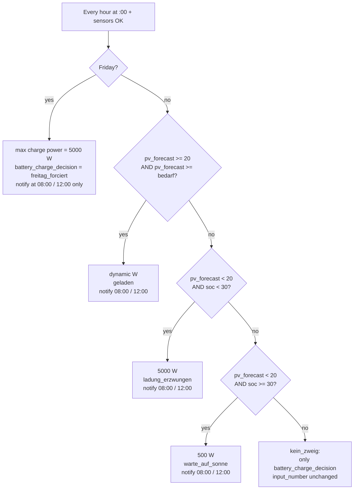

# PVoptimizer — Battery charge automation

This document describes the Home Assistant automations in this repository that implement **forecast- and SOC-aware limiting of battery max charge power** (Sungrow-oriented naming in the original setup).

Copies of the live YAML live in **`../yaml/`** so you can diff or install them without reading the narrative here.

---

## Table of contents

- [Home Assistant compatibility](#home-assistant-compatibility)
- [Business purpose](#business-purpose)
- [Goals](#goals)
- [Files in this repository](#files-in-this-repository)
- [Home Assistant wiring](#home-assistant-wiring)
- [Entities the automation expects](#entities-the-automation-expects)
- [Tunables (in `variables` / literals)](#tunables-in-variables--literals)
- [Computed quantities](#computed-quantities-conceptual)
- [Decision order](#decision-order-choose-branches)
- [Notifications](#notifications)
- [Reset automation](#reset-automation)
- [Assumptions and caveats](#assumptions-and-caveats)
- [Testing and verification](#testing-and-verification)
- [Optional dashboard (Lovelace)](#optional-dashboard-visualization-lovelace)
- [Installing from GitHub](#installing-from-github)
- [Versioning](#versioning)

## Home Assistant compatibility

- **Target:** Home Assistant **2024.1** or newer for the bundled YAML as written (`triggers` / `conditions` / `actions`, nested `choose`, and `system_log.write`).
- On older versions you may need legacy `trigger` / `condition` / `action` keys and a substitute for **`system_log.write`** (e.g. `logbook.log` only) if the service is missing.

---

## Business purpose

The PVoptimizer aligns **battery charge power** (from **PV only** in the intended installation) with **expected production** and **needs**, so charging is timed and sized for operational goals—not a single fixed “always max” limit.

**Assumption for this documentation:** the battery is **not** charged from the grid; surplus after the house load is either stored or **exported**. Limits on charge power therefore affect how PV energy is **shared in time** between the battery and the grid, not mix-in of purchased power.

### Outcomes the design targets

1. **Softer, steadier grid feed-in with fewer export spikes**  

   When the forecast indicates enough PV generation to cover household demand and fill the battery, charging can be moderated instead of running at maximum power from the start. A dynamic target, for example toward mid-afternoon, allows the battery to absorb PV production over a longer period.

   If the battery charges at full speed, it may reach a high state of charge early in the day. Once the battery is nearly full, any remaining PV surplus is exported to the grid as a sharp peak. By slowing the charge rate, the battery remains available as a buffer for longer, resulting in smoother and more level grid feed-in: less of an export valley while the battery is filling, and less of a tall export peak once it is full.

   At the same time, this supports the grid. If the EV is not charging, PV energy can already be exported in the morning instead of being almost completely absorbed by the home battery. This allows other consumers in the local grid to benefit from locally generated solar power earlier in the day. The grid operator also has to deal with a more gradual and predictable feed-in profile, rather than a sudden transition from very low export to high kW export once the battery is full.

   A moderated charging strategy can also be gentler on the battery. Lower charging currents typically generate less heat and reduce stress on the battery cells, which can be beneficial for battery chemistry and long-term battery health.

2. **Resilience on poor-sunshine days**  
   When the forecast is weak **and** the battery is still low, the logic **forces high charge power** so you do not run into the evening with an empty pack while hoping for sun that will not arrive. The business trade-off is explicit: **security of supply** beats stretching the charge window when SOC is critical.

3. **Comfortable reserve without rushing the pack from PV**  
   When the forecast is weak but SOC is already adequate, charge power is **cut to a minimum** (“wait for sun”). That avoids **pushing PV hard into the battery** to top up quickly when you already have enough buffer for typical overnight use—still **PV-only**, but gentler use of the headroom you have.

4. **Planned operational exception (Friday)**  
   One day a week the strategy **skips forecast math** and applies maximum charge power. In the original installation this matches a **household or pattern** (e.g. weekend demand, or a guaranteed full pack before Saturday/Sunday). Treat this as a **calendar-based business rule** you can retune or remove.

5. **Predictable handover at night**  
   The evening **reset** to a high charge limit returns a simple default for **night hours and non-PV logic**, so intraday optimisation does not accidentally constrain behaviour when the optimisation loop is not meant to run.

6. **Governance with limited noise**  
   Hourly execution keeps the strategy **responsive**; notifications only at **08:00** and **12:00** give operators enough **visibility** for decisions and troubleshooting without hourly push fatigue.

7. **Small-plant / EV synergy**  

   For smaller PV systems, for example around 8 kWp, this steadier battery behavior also helps the rest of the energy stack, such as EVCC or the wallbox. A smoother surplus signal makes it easier to ramp EV charging gradually instead of reacting to large swings in available power.

   A practical charging pattern could be to start the EV session earlier on single-phase 16 A (1P 16 A, about 3.7 kW), then switch to three-phase 6 A (3P 6 A, about 4.1 kW), and later increase to 3P 10 A as the PV curve allows. This keeps the EV charging session more continuous and helps use more of the limited roof peak, instead of waiting until the battery is already full and only responding to a short export spike.

### What this is not

- It is **not** a full retail optimization engine (no dynamic spot prices in the YAML as shipped).  
- It is **not** a warranty on inverter or battery hardware—limits still need to match vendor guidance.  
- Forecast and sensor quality dominate results; **garbage in → wrong outcome**.  
- It does **not** model installations where **grid charging** is deliberately used; if your site charges from the grid, reinterpret the business bullets accordingly.

---

## Goals

- Run **charge strategy logic every hour** (top of the hour) so the inverter limit tracks changing forecast and SOC during the day.
- **Notify** (Pushsafer via `notify.lanar`) only at **08:00** and **12:00**, not on every hourly run.
- Each evening, **reset** the charge power cap to a high default so night / non-PV behaviour stays predictable.

---

## Files in this repository

| File | Role |
|------|------|
| `yaml/pvoptimizer_charge.yaml` | Automation id `1751448147075` — hourly logic, **sensor gate** on SOC + forecast, **catch-all** `kein_zweig`, `system_log.write` |
| `yaml/pvoptimizer_reset.yaml` | Automation id `1751732737952` — 20:00 reset |
| `docs/assets/mushroom-battery-card.png` | Optional screenshot for the Lovelace example |

IDs are fixed so that replacing the YAML on an existing HA instance keeps history and entity links stable when possible.

---

## Home Assistant wiring

### Include in `automations.yaml`

```yaml
- !include automations/pvoptimizer_charge.yaml
- !include automations/pvoptimizer_reset.yaml
```

Order only affects display order in the UI; behaviour does not depend on it.

### Related config (example)

The original setup also defines a helper referenced by the automation (abbreviated):

```yaml
input_text:
  # für die Automatisierung der Batterieladung gemäß Forecast 2.7.2025
  battery_charge_decision:
    name: Batterie-Ladeentscheidung
    max: 30
```

Place this (or equivalent) in `configuration.yaml` or a merged package. The automation writes categorical states such as `freitag_forciert`, `geladen`, `ladung_erzwungen`, `warte_auf_sonne`, `kein_zweig` for debugging and dashboards.

---

### Charge automation gates (`pvoptimizer_charge.yaml`)

At **automation** level (before `actions`):

- **`sensor.battery_level`** and **`sensor.pv_forecast_today`** must not be `unknown`, `unavailable`, `none`, or empty. Otherwise the run is **skipped** (see **Decision order**).

Replace with your equivalents if names differ.

### Sensors

| Variable / use | Entity (example) | Notes |
|----------------|------------------|--------|
| SOC | `sensor.battery_level` | Percent 0–100 |
| PV forecast (kWh) | `sensor.pv_forecast_today` | Must match how you interpret “today” (full day vs remainder)—see **Assumptions** |
| Recent discharge / load proxy | `sensor.battery_discharge_avg_3m` | Used as a short-term consumption heuristic; scaled by **1.1** |

### Number / text helpers

| Entity | Purpose |
|--------|---------|
| `input_number.set_sg_battery_max_charge_power` | **Target** the automation writes (max charge power, W) |
| `input_text.battery_charge_decision` | Last branch label (traceability) |

### Notify service

| Service | Purpose |
|---------|---------|
| `notify.lanar` | Pushsafer (original). **Change** every `action: notify.lanar` block if you use `notify.mobile_app_*` or another integration |

---

## Tunables (in `variables` / literals)

All of these live in `pvoptimizer_charge.yaml` unless noted.

| Symbol / key | Default | Meaning |
|--------------|---------|---------|
| `batteriekapazitaet` | `10` | Nominal battery energy (kWh) used only in **kWh math** (fill requirement, dynamic power). Must match your real pack if the strategy should be numerically meaningful. |
| `soc_grenzwert` | `30` | SOC % below which “bad forecast” still forces strong charging |
| `prognose_schwelle` | `20` | Forecast kWh threshold that separates “enough PV expected” vs “bad day” branches |
| `mindest_ladeleistung` | `500` | Minimum W written when throttling on a bad day with SOC already comfortable |
| `maximal_ladeleistung` | `5000` | Maximum W used for forced / Friday / dynamic cap ceiling |
| `ziel_uhrzeit` | `15` | Hour (0–23) used to spread **remaining kWh to fill** into average power **until that hour** (see **Dynamic power**) |
| `eigenverbrauch` | `discharge_avg_raw * 1.1` | Heuristic “house + margin” kWh demand |

**Reset automation** (`pvoptimizer_reset.yaml`): the value `5000` should match your intended “fully open” cap (often same as `maximal_ladeleistung`).

---

## Computed quantities (conceptual)

Let:

- \( C \) = `batteriekapazitaet` (kWh)
- \( \text{soc} \) = SOC (%)
- \( \text{kWh\_empty} = C - (\text{soc}/100) \cdot C \) → `batterieladung`
- `eigenverbrauch` = short-term discharge average × 1.1 (kWh-ish treatment in YAML)
- **`bedarf`** = `eigenverbrauch + batterieladung` — interpreted as total **energy need** compared to **`pv_forecast`** in kWh (same dimension must hold in your forecast sensor).

### Dynamic charge power (`dynamische_ladeleistung`)

Approximate intent:

1. Hours until `ziel_uhrzeit` today (`restzeit`). If `restzeit <= 0`, the template falls back so the raw rate is 0 and clamps apply.
2. \( \text{kWh\_needed} \) = energy still missing in the pack (same as `batterieladung` in current YAML).
3. Ideal average power: \( (\text{kWh\_needed} / \text{restzeit}) \times 1000 \) W, then clamp to **[`mindest_ladeleistung`, `maximal_ladeleistung`]**.

So on “good PV” days the automation tries to **ease** charging toward full by mid-afternoon instead of always using 5 kW.

---

## Decision order (`choose` branches)

**Automation-level `conditions`:** If **`sensor.battery_level`** or **`sensor.pv_forecast_today`** is `unknown`, `unavailable`, or empty, the automation **does not run** (no `variables`, no `choose`, no `system_log`). This avoids writing limits from bogus `float(0)` arithmetic. **`sensor.battery_discharge_avg_3m`** is *not* gated (it already uses a numeric default in `variables`); add it to the condition in YAML if you want stricter behavior.

Evaluation inside `actions` is **first match wins**. **Friday is always checked first**; on Fridays the forecast/SOC branches are never evaluated.



**Friday:** `now().weekday() == 4` (Python: Monday = 0). Forecast/SOC math is skipped.

**“Good day” branch:** Forecast at least `prognose_schwelle` **and** at least `bedarf` — **dynamic** watts (e.g. forecast strong but still below `bedarf` falls through—see **Catch-all**).

**“Bad day, low SOC”:** Forecast below `prognose_schwelle` **and** SOC below `soc_grenzwert` — **max** charge power.

**“Bad day, SOC OK”:** Forecast below `prognose_schwelle` **and** SOC at/above `soc_grenzwert` — **min** charge power.

**Catch-all (last branch):** Example gap: **`pv_forecast >= prognose_schwelle`** but **`pv_forecast < bedarf`** (decent forecast that still does not cover house + fill). No `input_number` change; **`input_text.battery_charge_decision`** is set to **`kein_zweig`** so traces and the log line show an explicit label. Adjust thresholds or add another branch if you want a specific policy for that case.

## Notifications

- Wrapped in an inner `choose` with a **template condition** that must render the literal strings **`true`** or **`false`** (not a bare Jinja boolean only—see below). **Only when the clock is 08:00 or 12:00** (`hour` 8 or 12 **and** `minute == 0`) does the Pushsafer step run—matching the hourly trigger at **:00**, and avoiding pushes on most manual **Run** attempts (unless you execute exactly at 08:00 or 12:00).
- **Why explicit `true`/`false`:** A condition like `{{ now().hour in [8, 12] }}` can render ambiguous text; Home Assistant’s template condition expects an unambiguous pass/fail. Using `truefalse` makes the outcome reliable.
- **Logic still runs every hour**; only the notify step is gated.
- **System log:** after the main `choose`, **`system_log.write`** records one **info** line per run (logger name **`pvoptimizer`**) with timestamp, `battery_charge_decision`, max charge W, SOC, and forecast — visible under **Settings → System → Logs**. This is **not** limited to 08:00/12:00.

This is **independent** of any other automations you may have (e.g. a separate “PV Versorgung Prognose” at 07:30 / 12:00). This repo documents **only** the two PVoptimizer YAML files.

---

## Reset automation

**Trigger:** `20:00` daily.

**Action:** `input_number.set_sg_battery_max_charge_power` → `5000` (or your edited default).

Rationale: intraday you **shape** charging; in ther evening you **release** the cap so overnight behaviour follows inverter/EMS defaults or other automations.

---

## Assumptions and caveats

1. **Forecast semantics:** `pv_forecast_today` must be comparable to `bedarf` in kWh. If your integration reports “remaining today” vs “forecast from midnight,” sunrise vs noon behaviour will differ; validate in **Developer tools → Template**.
2. **Discharge average as load:** Not a full energy model; it is a cheap proxy. Tuning `×1.1` and the sensor choice changes aggressiveness.
3. **No forecast/SOC triggers:** Reacting only hourly means sudden forecast revisions **between** hours wait until the next :00.
4. **After `ziel_uhrzeit`:** Dynamic power template uses `restzeit > 0`; late afternoon behaviour may clamp toward **minimum** W in the “good PV” branch—confirm that matches your goals.
5. **Hardware:** `set_sg_battery_max_charge_power` is installation-specific. Ensure your integration accepts the written range and units.
6. **Sensor gate:** When SOC or forecast is missing, the automation does not run—`input_number` is left unchanged until the next successful run.

---

## Testing and verification

Do this on your Home Assistant instance after copying YAML and reloading automations.

### 1. Config loads cleanly

- **Developer tools → YAML** → **Check configuration**, then **Reload AUTOMATIONS** (or restart HA).
- If the check fails, fix paths (`!include`), indentation, or duplicate automation **IDs**.

### 2. Automations exist and are enabled

- **Settings → Automations & scenes → Automations**  
- Find **aOSC Batterie-Ladung PV-Prognose** and **aOSC Batterie Ladeleistung Reset um 20:00**.  
- Confirm they are **on** (toggle not off).

### 3. Preconditions (no `unknown` inputs)

- **Automation `conditions`:** If **`sensor.battery_level`** or **`sensor.pv_forecast_today`** is bad, the automation **stops before** `actions` (check the **trace**: failed condition). No `system_log` line from this run in that case.
- **Developer tools → Template** — `{{ states('sensor.battery_level') }}`, `{{ states('sensor.pv_forecast_today') }}`, `{{ states('sensor.battery_discharge_avg_3m') }}`.
- If any are `unknown` / `unavailable`, fix the entity or wait until sensors recover; optional branches in `variables` still assume numeric fallbacks only where coded.

### 4. Manual run (logic without waiting for :00)

- Open **aOSC Batterie-Ladung PV-Prognose** → **⋮** (or overflow menu) → **Run** / **Execute** (wording depends on HA version).  
- This fires **`actions`** as if the trigger occurred **now** (`now()` in templates is the **current** time).

**What to check after a manual run**

- **`input_number.set_sg_battery_max_charge_power`** changed to a value consistent with the active branch (and your forecast/SOC/Friday).  
- **`input_text.battery_charge_decision`** updated (e.g. `geladen`, `warte_auf_sonne`).  
- **Trace:** open the automation → **Traces** (or **Logbook** entry) → latest trace → expand steps to see which **`choose`** branch ran and whether **`notify.lanar`** ran or was skipped.
- **System log:** after every run (hourly or manual), the automation calls **`system_log.write`** at level **info** with logger **`pvoptimizer`**. In **Settings → System → Logs**, open the full log or search for `pvoptimizer` — you should see a line like `PVoptimizer: 2026-05-11 14:00 decision=… max_charge_W=… SOC=…% forecast_kWh=…`. This runs **once per execution** even when no Pushsafer message is sent.

### 5. Notification gating (08:00 and 12:00 only)

- **If you run manually at another time:** expect **no** Pushsafer—the gate requires **hour 8 or 12** and **minute 0** (same as scheduled runs at 08:00 and 12:00).  
- **At 08:00 or 12:00** (real time or wait for it): after a natural trigger, confirm a notification **only** if a branch that includes notify was taken.  
- To test **only** the notifier: **Developer tools → Services** → `notify.lanar` (or your service) with a test `message` — that bypasses the automation but proves the integration works.

### 6. Hourly trigger (production cadence)

- After an hour rolls to **:00**, confirm a new **trace** or **Logbook** entry for the charge automation.  
- Optional: **Settings → System → Logs** — look for errors mentioning this automation or `input_number.set_value`.

### 7. Reset automation

- **Run actions** on **aOSC Batterie Ladeleistung Reset um 20:00** manually, or wait until **20:00**.  
- Verify **`input_number.set_sg_battery_max_charge_power`** equals the configured reset value (default **5000**).

### 8. Safe testing tips

- Watch the **inverter / EMS** when changing max charge power; stay within vendor limits.  
- If your `input_number` has **min/max**, ensure forced values (e.g. 500, 5000) are inside that range or HA may error.  
- Keep a **backup** of working `automations.yaml` / includes before iterating.

---

## Optional dashboard visualization (Lovelace)

This is **optional UI sugar**: a **Mushroom** template card that shows actual battery charge/discharge power and, while charging, the **configured max charge power** from `input_number.set_sg_battery_max_charge_power` (the same helper PVoptimizer writes).

### Example (dashboard)


*Live example: **Batterie Leistung** with secondary line `Lädt mit 1017W (Max 1030W)` — actual power vs. cap from `input_number.set_sg_battery_max_charge_power`.*

### Requirements

- [**Mushroom**](https://github.com/piitaya/lovelace-mushroom) (e.g. via HACS).
- Entities on your system (adjust if yours differ):
  - `sensor.battery_charging_power`
  - `sensor.battery_discharging_power`
  - `input_number.set_sg_battery_max_charge_power`

### Card YAML

```yaml
type: custom:mushroom-template-card
entity: sensor.battery_charging_power
primary: Batterie Leistung
secondary: |
  
  
  
  
  
  
    
      Lädt mit {{ charge | round(0) }}W (Max {{ max_w | round(0) }}W)
    
      Lädt mit {{ charge | round(0) }}W
    
  
    Entlädt mit {{ discharge | round(0) }} W
  
    Batterie im Ruhezustand
  
icon: >
  
  
  
    mdi:battery-charging
  
    mdi:battery-arrow-down
  
    mdi:battery
  
icon_color: >
  
  
  
    green
  
    orange
  
    grey
  
tap_action:
  action: more-info
hold_action:
  action: more-info
features_position: bottom
grid_options:
  columns: 12
  rows: 1
```

**Example secondary line while charging:** `Lädt mit 58W (Max 1000W)` (see screenshot above for `1017W` / `1030W`).

If the literal block adds unwanted line breaks in your Mushroom version, use a **single-line** `secondary` instead (still omits `Max` when the `input_number` is unavailable):

```yaml
secondary: "Lädt mit {{ c | round(0) }}W (Max {{ m | round(0) }}W)Lädt mit {{ c | round(0) }}WEntlädt mit {{ d | round(0) }} WBatterie im Ruhezustand"
```

### YAML pitfall: “duplicated mapping key”

- Ensure the card has **only one** `secondary:` key (remove an old block when pasting an updated one).
- Every line under `secondary: >` or `secondary: |` must stay **indented** under `secondary:`; if a line is flushed left, the YAML parser can mis-read the file and surface duplicate-key or parse errors.
- Prefer **`secondary: |`** (or the one-line `secondary: "..."`) if `secondary: >` causes issues in your editor.

---

## Installing from GitHub

1. Clone this repo.
2. Copy `yaml/*.yaml` into your HA `config/automations/` (or merge patterns into your own files).
3. Add `!include` lines as above.
4. Align entities and notifier; reload automations.

---

## Versioning

- Update **`yaml/`** in this repo whenever you change production automations so GitHub stays the **single source of truth** alongside this document.
- Human-readable release notes: [CHANGELOG.md](../CHANGELOG.md).

---
